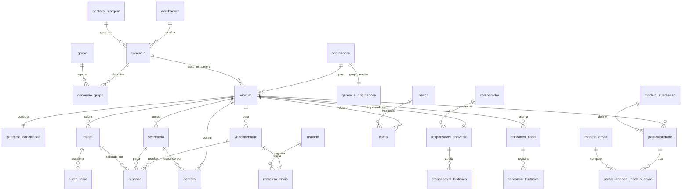

# DER-MCN — SCO Controle Operacional

> Modelagem de Banco de Dados Modular por Contexto de Negócio (DER-MCN),
> com destino **Supabase / PostgreSQL**. Substitui o file-store atual
> (pasta = tabela, `.txt` JSON por registro) por um modelo relacional em 3FN.
>
> Diagrama visual editável: [`der_mcn_sco.drawio`](der_mcn_sco.drawio).

---

## 1. Legenda

Antes de ler o modelo, os símbolos e convenções usados no documento:

### Chaves
- **PK (Chave Primária)** — campo que identifica de forma única cada registro
  da tabela. Convenção: `id_nome_tabela` (ex.: `id_convenio`).
- **FK (Chave Estrangeira)** — campo que referencia o registro de outra tabela,
  criando o relacionamento. Convenção: `id_tabela_referenciada` (ex.: `id_vinculo`).

### Cardinalidades
- **1:1** — um registro se relaciona com no máximo um registro do outro lado.
- **1:N** — um registro se relaciona com vários do outro lado.
- **N:1** — vários registros se relacionam com um só (visão inversa do 1:N).
- **N:N** — vários para vários, sempre resolvido por uma **tabela de ligação**.

### Convenções de nome de campo
- Prefixo `id_` → chave (PK ou FK).
- Prefixo `data_` → campo de data/hora.
- Nomes como `ativo`, `principal`, `padrao` → campo booleano (sim/não).
- Prefixo `valor_` → campo monetário (`numeric`); `percentual_`/`aliquota_` → percentual.

### Níveis da hierarquia
- **Sistema** — a aplicação inteira (SCO — Controle Operacional).
- **Módulo** — grande área de negócio (Gestão de Convênios, Conciliação…).
- **Submódulo** — recorte funcional dentro do módulo (Cadastros, Vínculos…).
- **Página** — uma tela do submódulo.
- **Aba** — seção dentro de uma página.
- **Grupo de Dependência** — conjunto de tabelas que um mesmo componente da tela
  consome junto (alta coesão).
- **Entidade** — uma tabela; **Campo** — uma coluna.

### O que cada Grupo de Dependência representa
- **Grupo Originadora** — a empresa que origina os contratos; funciona como grupo master dos convênios.
- **Grupo Averbadora** — órgãos que averbam a margem consignável e as gestoras de margem.
- **Grupo Convênio** — o órgão conveniado onde os contratos são consignados.
- **Grupo Classificação** — agrupamento livre de convênios (dimensão gerencial, N:N).
- **Grupo Vínculo** — liga uma originadora a um convênio; é o centro operacional do sistema.
- **Grupo Custo** — a regra de cobrança do serviço por vínculo, versionada por vigência.
- **Grupo Controle de Conciliação** — liga/desliga a conciliação e parametriza o ciclo de vencimento.
- **Grupo Vencimentário** — a competência gerada por vínculo: valores e status da conciliação.
- **Grupo Remessa** — o controle de envio da remessa de cada vencimento.
- **Grupo Repasse** — recebimento por secretaria, custo aplicado e cálculo do valor devido.
- **Grupo Secretaria** — as entidades pagadoras vinculadas ao convênio.
- **Grupo Contato** — as pessoas de contato no convênio/secretaria.
- **Grupo Particularidade** — regras específicas: rubrica, modelo de averbação e modelos de envio.
- **Grupo Conta Bancária** — os dados bancários usados no repasse.
- **Grupo Responsável** — titular e substituto da conciliação por vínculo, com auditoria.
- **Grupo Cobrança** — casos de cobrança de inadimplência e as tentativas de contato.
- **Grupo Acesso** — os usuários do sistema (mapeável ao Supabase Auth).

---

## 2. Visão Geral da Arquitetura

```
SCO — Controle Operacional
├── Módulo: Gestão de Convênios
│   ├── Submódulo: Cadastros Estruturais
│   │   ├── Página Originadoras → Aba Dados Gerais → Grupo Originadora → [Originadora]
│   │   ├── Página Averbadoras → Aba Dados Gerais → Grupo Averbadora → [Averbadora, Gestora de Margem]
│   │   └── Página Convênios
│   │       ├── Aba Dados Gerais → Grupo Convênio → [Convênio]
│   │       └── Aba Classificação → Grupo Classificação → [Grupo, Convênio Grupo]
│   └── Submódulo: Vínculos e Custos
│       └── Página Vínculo
│           ├── Aba Dados Gerais → Grupo Vínculo → [Vínculo]
│           └── Aba Custo → Grupo Custo → [Custo, Custo Faixa]
│
├── Módulo: Conciliação
│   ├── Submódulo: Gerência de Convênios
│   │   └── Página Gerência → Aba Controle → Grupo Controle de Conciliação
│   │       → [Gerência Conciliação, Gerência Originadora]
│   ├── Submódulo: Controle Analítico
│   │   └── Página Controle Analítico
│   │       ├── Aba Dados Gerais → Grupo Vencimentário → [Vencimentário]
│   │       ├── Aba Remessa → Grupo Remessa → [Remessa Envio]
│   │       ├── Aba Financeiro → Grupo Repasse → [Repasse]
│   │       ├── Aba Secretarias → Grupo Secretaria → [Secretaria]
│   │       ├── Aba Contatos → Grupo Contato → [Contato]
│   │       ├── Aba Particularidades → Grupo Particularidade
│   │       │   → [Particularidade, Modelo Averbação, Modelo Envio, Particularidade Modelo Envio]
│   │       └── Aba Contas → Grupo Conta Bancária → [Conta, Banco]
│   └── Submódulo: Responsáveis pela Conciliação
│       └── Página Responsáveis → Aba Dados Gerais → Grupo Responsável
│           → [Colaborador, Responsável Convênio, Responsável Histórico]
│
├── Módulo: Cobrança
│   └── Submódulo: Cobrança de Inadimplência
│       └── Página Casos → Aba Dados Gerais → Grupo Cobrança
│           → [Cobrança Caso, Cobrança Tentativa]
│
└── Módulo: Segurança
    └── Submódulo: Controle de Acesso
        └── Página Usuários → Aba Dados Gerais → Grupo Acesso → [Usuário]
```

---

## 3. Diagrama Hierárquico

```
SCO — Controle Operacional
┌───────────────────────────────────────────────────────────────────────┐
│ Módulo: Gestão de Convênios                                            │
│ ┌───────────────────────────────────┐ ┌─────────────────────────────┐ │
│ │ Sub: Cadastros Estruturais        │ │ Sub: Vínculos e Custos      │ │
│ │ ┌───────────────┐ ┌─────────────┐ │ │ ┌─────────────────────────┐ │ │
│ │ │ Grupo         │ │ Grupo       │ │ │ │ Grupo Vínculo           │ │ │
│ │ │ Originadora   │ │ Averbadora  │ │ │ │  Vínculo                │ │ │
│ │ │  Originadora  │ │  Averbadora │ │ │ ├─────────────────────────┤ │ │
│ │ └───────────────┘ │  Gestora    │ │ │ │ Grupo Custo             │ │ │
│ │ ┌───────────────┐ └─────────────┘ │ │ │  Custo, Custo Faixa     │ │ │
│ │ │ Grupo Convênio│ ┌─────────────┐ │ │ └─────────────────────────┘ │ │
│ │ │  Convênio     │ │ Grupo Class.│ │ │                             │ │
│ │ └───────────────┘ │ Grupo,Conv.G│ │ │                             │ │
│ │                   └─────────────┘ │ │                             │ │
│ └───────────────────────────────────┘ └─────────────────────────────┘ │
└───────────────────────────────────────────────────────────────────────┘
┌───────────────────────────────────────────────────────────────────────┐
│ Módulo: Conciliação                                                   │
│ ┌───────────────┐ ┌───────────────────────────────┐ ┌───────────────┐ │
│ │ Sub: Gerência │ │ Sub: Controle Analítico       │ │ Sub: Respons. │ │
│ │ Ctrl.Concil.  │ │ Vencimentário / Remessa /     │ │ Colaborador   │ │
│ │ Ger.Concil.   │ │ Repasse / Secretaria /Contato/│ │ Resp.Convênio │ │
│ │ Ger.Originad. │ │ Particularidade / Conta,Banco │ │ Resp.Histórico│ │
│ └───────────────┘ └───────────────────────────────┘ └───────────────┘ │
└───────────────────────────────────────────────────────────────────────┘
┌─────────────────────────────────┐ ┌─────────────────────────────────┐
│ Módulo: Cobrança                │ │ Módulo: Segurança               │
│  Grupo Cobrança                 │ │  Grupo Acesso                   │
│   Cobrança Caso, Cobr.Tentativa │ │   Usuário                       │
└─────────────────────────────────┘ └─────────────────────────────────┘
```

---

## 4. DER

Relação de entidades e relacionamentos (cardinalidade lida da origem para o
destino). Diagrama Mermaid abaixo; versão visual completa no `.drawio`.



---

## 5. Dicionário de Dados

> Formato por tabela: **Objetivo · Responsabilidade · Consumidores ·
> Dependências · Campos · Relacionamentos**. Campos autoexplicativos
> (`nome`, `observacao`) não recebem nota.

### Módulo Gestão de Convênios

#### Originadora — `tb_originadora`
- **Objetivo:** cadastrar a empresa que origina os contratos consignados.
- **Responsabilidade:** identidade e situação da originadora; atua como grupo master.
- **Consumidores:** Vínculo, Gerência Originadora, todos os relatórios por originadora.
- **Dependências:** nenhuma.
- **Campos:** `id_originadora` (PK) · `nome` · `codigo` — sigla curta usada na geração
  do número do convênio · `cnpj` · `ativo` · `observacao` · `data_cadastro`.
- **Relacionamentos:** 1:N Vínculo; 1:1 Gerência Originadora.

#### Averbadora — `tb_averbadora`
- **Objetivo:** catalogar os órgãos/empresas que averbam a margem consignável.
- **Responsabilidade:** vida própria — reutilizada por vários convênios.
- **Consumidores:** Convênio.
- **Dependências:** nenhuma.
- **Campos:** `id_averbadora` (PK) · `nome` · `cnpj` · `ativo` · `observacao`.
- **Relacionamentos:** 1:N Convênio.

#### Gestora de Margem — `tb_gestora_margem`
- **Objetivo:** catalogar as plataformas gestoras de margem.
- **Responsabilidade:** identidade e portal de acesso da gestora.
- **Consumidores:** Convênio.
- **Dependências:** nenhuma.
- **Campos:** `id_gestora_margem` (PK) · `nome` · `link_portal` — URL do portal da gestora · `ativo`.
- **Relacionamentos:** 1:N Convênio.

#### Convênio — `tb_convenio`
- **Objetivo:** representar o órgão conveniado onde os contratos são consignados.
- **Responsabilidade:** dados mestre do convênio, independentes da originadora.
- **Consumidores:** Vínculo, Classificação, telas de Gestão.
- **Dependências:** Averbadora, Gestora de Margem.
- **Campos:** `id_convenio` (PK) · `id_averbadora` (FK) · `id_gestora_margem` (FK) ·
  `cnpj` — chave natural única · `nome` · `status` — situação de Gestão · `status_producao`
  — situação de produção/importação · `ativo` · `observacao` · `data_cadastro`.
- **Relacionamentos:** N:1 Averbadora; N:1 Gestora de Margem; 1:N Vínculo; 1:N Convênio Grupo.

#### Grupo — `tb_grupo`
- **Objetivo:** rótulo gerencial livre para agrupar convênios.
- **Responsabilidade:** dimensão de agrupamento paralela à originadora.
- **Consumidores:** Convênio Grupo.
- **Campos:** `id_grupo` (PK) · `nome` · `ativo`.
- **Relacionamentos:** 1:N Convênio Grupo.

#### Convênio Grupo — `tb_convenio_grupo`
- **Objetivo:** tabela de ligação N:N entre Convênio e Grupo.
- **Responsabilidade:** resolver a relação muitos-para-muitos sem duplicar dados.
- **Dependências:** Convênio, Grupo.
- **Campos:** `id_convenio_grupo` (PK) · `id_convenio` (FK) · `id_grupo` (FK).
- **Relacionamentos:** N:1 Convênio; N:1 Grupo.

#### Vínculo — `tb_vinculo`
- **Objetivo:** ligar uma originadora a um convênio — o **centro operacional** do sistema.
- **Responsabilidade:** identidade operacional (número do convênio) e vigência.
- **Consumidores:** Custo, Gerência Conciliação, Vencimentário, Responsável, abas do Analítico, Cobrança.
- **Dependências:** Originadora, Convênio.
- **Campos:** `id_vinculo` (PK) · `id_originadora` (FK) · `id_convenio` (FK) ·
  `numero_convenio` — gerado por `codigo` da originadora + sequencial, único ·
  `ativo` · `data_competencia_inicio` · `data_competencia_fim` · `observacao`.
- **Relacionamentos:** N:1 Originadora; N:1 Convênio; 1:1 Gerência Conciliação;
  1:1 Responsável Convênio; 1:N Custo/Vencimentário/Secretaria/Contato/Particularidade/Conta/Cobrança.

#### Custo — `tb_custo`
- **Objetivo:** registrar a regra de cobrança do serviço por vínculo.
- **Responsabilidade:** versionamento por vigência + ativação (histórico preservado).
- **Consumidores:** Repasse (custo aplicado), telas de Custo.
- **Dependências:** Vínculo.
- **Campos:** `id_custo` (PK) · `id_vinculo` (FK) · `metodo` — PERCENTUAL/FIXO_MENSAL/POR_CONTRATO/FAIXA ·
  `base_calculo` · `aliquota_percentual` · `valor_fixo` · `valor_unitario` ·
  `data_vigencia_inicio` · `data_vigencia_fim` · `ativo` — regra ATIVA/INATIVA na competência.
- **Relacionamentos:** N:1 Vínculo; 1:N Custo Faixa; 1:N Repasse.

#### Custo Faixa — `tb_custo_faixa`
- **Objetivo:** detalhar as faixas do método FAIXA.
- **Responsabilidade:** escalonamento do custo por valor.
- **Dependências:** Custo.
- **Campos:** `id_custo_faixa` (PK) · `id_custo` (FK) · `valor_ate` — limite superior da faixa ·
  `aliquota_percentual` · `valor_fixo` · `valor_unitario`.
- **Relacionamentos:** N:1 Custo.

### Módulo Conciliação

#### Gerência Conciliação — `tb_gerencia_conciliacao`
- **Objetivo:** controlar se o vínculo está em conciliação e parametrizar o ciclo de vencimento.
- **Responsabilidade:** estado da conciliação **independente** do status de Gestão.
- **Consumidores:** motor de geração de vencimentários.
- **Dependências:** Vínculo.
- **Campos:** `id_gerencia_conciliacao` (PK) · `id_vinculo` (FK) · `em_conciliacao` — liga/desliga ·
  `dia_vencimento` — dia único (1–30, regra "valor presente") · `dias_antes_remessa` ·
  `qtd_dias_sla_pagamento` · `dias_antes_corte` · `data_alteracao` · `ator`.
- **Relacionamentos:** 1:1 Vínculo.

#### Gerência Originadora — `tb_gerencia_originadora`
- **Objetivo:** ligar/desligar a conciliação no nível da originadora (grupo master).
- **Responsabilidade:** habilitação em lote por originadora.
- **Dependências:** Originadora.
- **Campos:** `id_gerencia_originadora` (PK) · `id_originadora` (FK) · `em_conciliacao` ·
  `data_alteracao` · `ator`.
- **Relacionamentos:** 1:1 Originadora.

#### Vencimentário — `tb_vencimentario`
- **Objetivo:** materializar a competência gerada por vínculo.
- **Responsabilidade:** valores da conciliação e status de cada competência/vencimento.
- **Consumidores:** Remessa, Repasse, indicadores.
- **Dependências:** Vínculo.
- **Campos:** `id_vencimentario` (PK) · `id_vinculo` (FK) · `competencia` — AAAA-MM ·
  `data_vencimento` · `data_envio_remessa` · `data_sla_conciliacao` · `data_corte` ·
  `valor_remessa` · `valor_retorno` · `valor_repasse` · `status_conciliacao` ·
  `motivo_falta_conciliacao` · `percentual_inadimplencia` · `data_cadastro`.
- **Relacionamentos:** N:1 Vínculo; 1:1 Remessa Envio; 1:N Repasse.

#### Remessa Envio — `tb_remessa_envio`
- **Objetivo:** controlar o envio da remessa de cada vencimento.
- **Responsabilidade:** situação e auditoria do envio.
- **Dependências:** Vencimentário, Usuário.
- **Campos:** `id_remessa_envio` (PK) · `id_vencimentario` (FK) · `id_usuario` (FK) ·
  `situacao` — PENDENTE/ENVIADA · `data_envio` · `observacao`.
- **Relacionamentos:** 1:1 Vencimentário; N:1 Usuário.

#### Repasse — `tb_repasse`
- **Objetivo:** registrar o recebimento por secretaria e o resultado financeiro.
- **Responsabilidade:** grava o snapshot do custo aplicado e o valor devido; `status_financeiro`
  definido automaticamente pelo backend.
- **Dependências:** Vencimentário, Secretaria, Custo.
- **Campos:** `id_repasse` (PK) · `id_vencimentario` (FK) · `id_secretaria` (FK) ·
  `id_custo` (FK) — qual regra de custo entrou no cálculo · `status_financeiro`
  — Conciliado/Conciliado a maior/Conciliado a menor/Divergente · `data_recebimento` ·
  `valor_recebido` · `quantidade` · `valor_custo_aplicado` — custo calculado no momento ·
  `valor_devendo` — (retorno − recebido) + custo · `observacao`.
- **Relacionamentos:** N:1 Vencimentário; N:1 Secretaria; N:1 Custo.

#### Secretaria — `tb_secretaria`
- **Objetivo:** cadastrar as entidades pagadoras vinculadas ao convênio.
- **Responsabilidade:** identidade da secretaria por vínculo.
- **Consumidores:** Repasse, Contato.
- **Dependências:** Vínculo.
- **Campos:** `id_secretaria` (PK) · `id_vinculo` (FK) · `nome` · `codigo` · `ativo` · `observacao`.
- **Relacionamentos:** N:1 Vínculo; 1:N Repasse; 1:N Contato.

#### Contato — `tb_contato`
- **Objetivo:** registrar as pessoas de contato no convênio/secretaria.
- **Dependências:** Vínculo, Secretaria (opcional).
- **Campos:** `id_contato` (PK) · `id_vinculo` (FK) · `id_secretaria` (FK, opcional) ·
  `nome` · `email` · `telefone` · `area` · `ativo`.
- **Relacionamentos:** N:1 Vínculo; N:1 Secretaria.

#### Particularidade — `tb_particularidade`
- **Objetivo:** guardar regras específicas de operação do vínculo.
- **Dependências:** Vínculo, Modelo Averbação.
- **Campos:** `id_particularidade` (PK) · `id_vinculo` (FK) · `id_modelo_averbacao` (FK) ·
  `rubrica_produto` · `ativo` · `observacao`.
- **Relacionamentos:** N:1 Vínculo; N:1 Modelo Averbação; 1:N Particularidade Modelo Envio.

#### Modelo Averbação — `tb_modelo_averbacao`
- **Objetivo:** catálogo de modelos de averbação (flag único).
- **Campos:** `id_modelo_averbacao` (PK) · `nome` · `ativo`.
- **Relacionamentos:** 1:N Particularidade.

#### Modelo Envio — `tb_modelo_envio`
- **Objetivo:** catálogo de modelos de envio (podem ser múltiplos por particularidade).
- **Campos:** `id_modelo_envio` (PK) · `nome` · `ativo`.
- **Relacionamentos:** 1:N Particularidade Modelo Envio.

#### Particularidade Modelo Envio — `tb_particularidade_modelo_envio`
- **Objetivo:** tabela de ligação N:N — modelos de envio de uma particularidade.
- **Dependências:** Particularidade, Modelo Envio.
- **Campos:** `id_particularidade_modelo_envio` (PK) · `id_particularidade` (FK) · `id_modelo_envio` (FK).
- **Relacionamentos:** N:1 Particularidade; N:1 Modelo Envio.

#### Conta — `tb_conta`
- **Objetivo:** dados bancários usados no repasse.
- **Dependências:** Vínculo, Banco.
- **Campos:** `id_conta` (PK) · `id_vinculo` (FK) · `id_banco` (FK) · `agencia` ·
  `numero_conta` · `chave_pix` · `cnpj` · `ativo`.
- **Relacionamentos:** N:1 Vínculo; N:1 Banco.

#### Banco — `tb_banco`
- **Objetivo:** catálogo de bancos (código COMPE).
- **Campos:** `id_banco` (PK) · `codigo_compe` — código de 3 dígitos do banco · `nome`.
- **Relacionamentos:** 1:N Conta.

#### Colaborador — `tb_colaborador`
- **Objetivo:** cadastro de colaboradores que atuam na conciliação.
- **Responsabilidade:** identidade e situação (ATIVO/DESLIGADO).
- **Consumidores:** Responsável Convênio (titular e substituto).
- **Campos:** `id_colaborador` (PK) · `nome` · `ativo` · `observacao`.
- **Relacionamentos:** 1:N Responsável Convênio.

#### Responsável Convênio — `tb_responsavel_convenio`
- **Objetivo:** definir titular e substituto temporário da conciliação por vínculo.
- **Responsabilidade:** substituição com retorno automático; o responsável efetivo é
  calculado (titular, ou substituto durante a vigência).
- **Dependências:** Vínculo, Colaborador (titular e substituto).
- **Campos:** `id_responsavel_convenio` (PK) · `id_vinculo` (FK) ·
  `id_colaborador_titular` (FK) · `id_colaborador_substituto` (FK) ·
  `data_fim_substituicao` — término da substituição temporária · `data_alteracao` · `ator`.
- **Relacionamentos:** 1:1 Vínculo; N:1 Colaborador (×2); 1:N Responsável Histórico.

#### Responsável Histórico — `tb_responsavel_historico`
- **Objetivo:** auditoria das trocas de responsável.
- **Dependências:** Responsável Convênio.
- **Campos:** `id_responsavel_historico` (PK) · `id_responsavel_convenio` (FK) ·
  `acao` · `valor_de` — estado anterior · `valor_para` — estado novo · `ator` · `data_evento`.
- **Relacionamentos:** N:1 Responsável Convênio.

### Módulo Cobrança

#### Cobrança Caso — `tb_cobranca_caso`
- **Objetivo:** abrir um caso de cobrança de inadimplência por vínculo/competência.
- **Dependências:** Vínculo.
- **Campos:** `id_cobranca_caso` (PK) · `id_vinculo` (FK) · `competencia` · `valor` ·
  `status` · `data_abertura`.
- **Relacionamentos:** N:1 Vínculo; 1:N Cobrança Tentativa.

#### Cobrança Tentativa — `tb_cobranca_tentativa`
- **Objetivo:** registrar cada tentativa de contato do caso.
- **Dependências:** Cobrança Caso.
- **Campos:** `id_cobranca_tentativa` (PK) · `id_cobranca_caso` (FK) · `canal` ·
  `resultado` · `data_tentativa`.
- **Relacionamentos:** N:1 Cobrança Caso.

### Módulo Segurança

#### Usuário — `tb_usuario`
- **Objetivo:** usuários do sistema (login e perfil).
- **Responsabilidade:** identidade de acesso; mapeável ao Supabase Auth.
- **Consumidores:** Remessa Envio, auditorias (`ator`).
- **Campos:** `id_usuario` (PK) · `email` — único · `nome` · `perfil` · `senha_hash` ·
  `ativo` · `data_cadastro`.
- **Relacionamentos:** 1:N Remessa Envio.

---

## 6. Justificativas Arquiteturais

### Por que estas viraram tabelas (têm vida própria)
- **Averbadora, Gestora de Margem, Banco, Modelo Averbação, Modelo Envio** eram texto no
  file-store. São catálogos reutilizáveis por vários registros — normalizá-los elimina
  digitação divergente ("Banco do Brasil" vs "BB") e permite manter atributos próprios.
- **Grupo** e **Colaborador** têm ciclo de vida independente do convênio.

### Por que estes permaneceram colunas (atributos)
- `status`, `status_producao`, `status_conciliacao`, `status_financeiro`, `metodo`,
  `situacao` são **domínios controlados fixos** (não catálogos administráveis pelo usuário).
  Recomendação: `ENUM` nativo do Postgres ou `text` + `CHECK` — sem tabela de apoio,
  evitando joins e tabelas anêmicas. `percentual_inadimplencia`, `valor_*`, `dia_vencimento`
  são medidas simples do próprio registro.

### Por que o Vínculo é o núcleo
Toda operação (conciliação, custo, responsável, remessa, financeiro, particularidades,
cobrança) acontece na combinação **originadora × convênio**, não no convênio isolado.
Centralizar as FKs em `id_vinculo` mantém 3FN e evita repetir originadora+convênio em
cada tabela satélite.

### Por que a modularização em grupos
Cada Grupo de Dependência corresponde a uma aba/componente da tela: abrir a aba
"Particularidades" carrega exatamente `Particularidade + Modelo Averbação + Modelo Envio`.
Alta coesão dentro do grupo, baixo acoplamento entre grupos — o desenvolvedor sabe, só
pelo diagrama, quais tabelas tocar ao mexer numa tela.

### Chave técnica + chave natural
PK sempre `id_*` (surrogate) com as chaves naturais (`cnpj`, `numero_convenio`, `email`,
`codigo`) como `UNIQUE`. FKs referenciam o `id`, não o texto — permite corrigir um CNPJ
sem quebrar relacionamentos.

### N:N sempre com tabela de ligação
`Convênio × Grupo` e `Particularidade × Modelo Envio` (o "modelo de envio múltiplo"
pedido) usam tabelas de ligação, mantendo 3FN e sem colunas multivaloradas.

### Custo e Repasse — snapshot auditável
`Custo` é versionado (vigência + `ativo`); o `Repasse` grava `id_custo` +
`valor_custo_aplicado` no momento do cálculo. Assim, alterar a regra de custo depois
não reescreve o histórico financeiro já apurado.

### Auditoria e destino Supabase
Tabelas mutáveis carregam `data_cadastro`/`data_alteracao` (`timestamptz`) e `ator`.
No Supabase: FKs com `on delete restrict`, RLS por perfil, e `tb_usuario` podendo ser
substituída/estendida por `auth.users` (ligando `id_usuario` ao `uuid` do Auth).
Indicadores de conciliação (mês/quadrimestre/ano) devem ser uma **VIEW** sobre
`tb_vencimentario`, não uma tabela.

---

### Pontos ainda a decidir antes do DDL
1. **Competência** — `char(7)` AAAA-MM ou `date` (1º dia do mês)?
2. **Remessa** — 1:1 com o vencimentário (atual) ou 1:N (histórico de reenvio)?
3. **Usuários** — `tb_usuario` própria ou `auth.users` nativo do Supabase (uuid)?
4. **Domínios** — `ENUM` nativo ou `text` + `CHECK` para status/método/situação?
5. **Grupo (classificação)** — confirmar se a 2ª dimensão de agrupamento é necessária.
