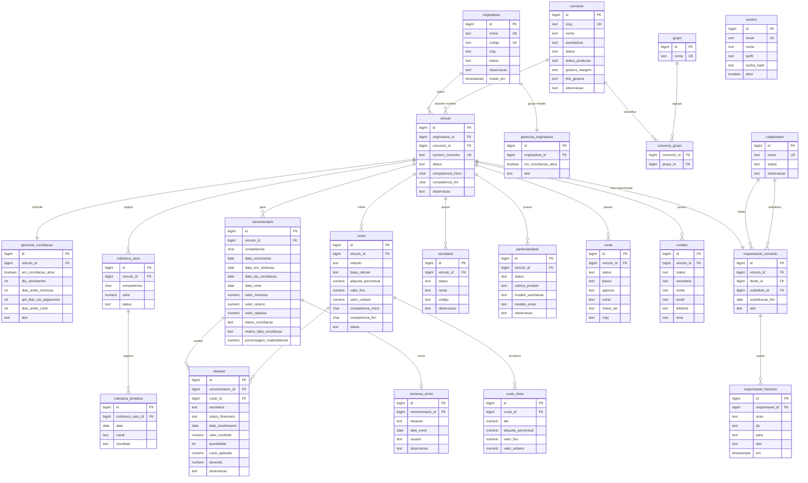

# DER — SCO Controle Operacional

Modelagem relacional proposta para migração do file-store atual (pasta = tabela,
subpasta = competência, um `.txt` JSON por registro) para **Supabase / PostgreSQL**.

> Versão para revisão. Renderização visual (light/dark) em [`der_sco.html`](der_sco.html).

## Diagrama

## Domínios

| Domínio | Tabelas |
|---|---|
| **Gestão de Convênios** | `originadora`, `convenio`, `vinculo`, `grupo`, `convenio_grupo`, `custo`, `custo_faixa` |
| **Conciliação / Gerência** | `gerencia_conciliacao`, `gerencia_originadora`, `vencimentario`, `remessa_envio` |
| **Responsáveis** | `colaborador`, `responsavel_convenio`, `responsavel_historico` |
| **Financeiro** | `repasse` |
| **Analítico (abas do convênio)** | `secretaria`, `particularidade`, `conta`, `contato` |
| **Cobrança** | `cobranca_caso`, `cobranca_tentativa` |
| **Sistema** | `usuario` + indicadores como `VIEW` |

## Decisões de modelagem

- **Chave técnica + chave natural** — toda tabela tem `id bigint identity` como PK; as
  chaves imutáveis do domínio (CNPJ, nome, numero_convenio) viram `UNIQUE`. FKs referenciam
  o `id`, não o texto, permitindo correção sem quebrar vínculos.
- **O `vinculo` é o centro** — convênio × originadora. Conciliação, custo, responsável,
  remessa, financeiro e abas do analítico penduram no vínculo, não no convênio mestre.
- **Competência como `char(7)` AAAA-MM** — espelha o file-store e ordena lexicograficamente.
  (Alternativa: `date` truncado ao 1º dia — a decidir.)
- **Custo versionado, não sobrescrito** — `custo` guarda histórico por vigência + `status`
  ATIVO/INATIVO; `custo_faixa` só no método FAIXA. O custo vigente é calculado por competência.
- **Financeiro registra o custo aplicado** — `repasse.custo_id` + `custo_aplicado` + `devendo`
  gravam o snapshot auditável; `status_financeiro` é definido pelo backend.
- **Status independentes** — Gestão (`convenio.status`) e Conciliação
  (`gerencia_conciliacao.em_conciliacao_ativa`) em tabelas distintas: coexistem, não se influenciam.
- **Auditoria em toda tabela mutável** — `criado_em` / `atualizado_em` (`timestamptz`) e `ator`;
  histórico de responsável em `responsavel_historico`.
- **Indicadores = VIEW** — indicadores de conciliação (mês/quadrimestre/ano) não são tabela:
  `VIEW` (ou materialized view) agregando `vencimentario`. Zero duplicação de dado.

## Pontos a decidir antes do DDL

1. **Competência**: manter `char(7)` AAAA-MM ou migrar para `date` (1º dia do mês)?
2. **Remessa**: `remessa_envio` 1:1 com o vencimentário ou 1:N (histórico de reenvio)?
3. **Modelo de envio** (particularidade, múltiplo): normalizar em `particularidade_envio` (N:N)
   ou manter como array/texto?
4. **Grupo master**: a originadora já agrupa convênios via `vinculo`; `grupo`/`convenio_grupo`
   é 2ª dimensão de agrupamento — confirmar necessidade.
5. **Usuários**: usar `auth.users` nativo do Supabase (uuid) ou tabela própria com `senha_hash`?
6. **Enums**: `ENUM` nativo do Postgres ou `text` + CHECK constraint?
